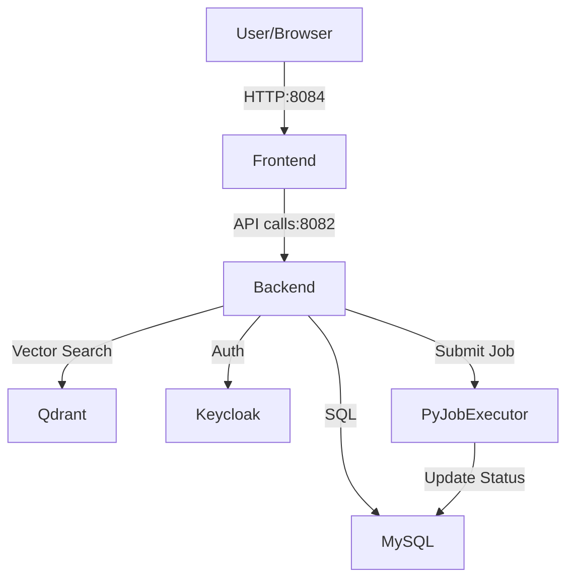

# Docker Setup for Essedum Platform

This directory contains the Docker Compose configuration to deploy the Essedum platform.

## Design and Architecture

The Essedum platform is containerized using Docker to ensure consistent deployment across environments. The `docker-compose.yml` file orchestrates the following services:

### Core Services
*   **Frontend (`frontend`)**:
    *   **Source**: `../essedum-ui`
    *   **Role**: Serves the Angular-based UI applications (`aip-app-ui` and `shell-app-ui`) via Nginx.
    *   **Port**: 8084

*   **Backend (`leap-app-backend-service`)**:
    *   **Source**: `../sv`
    *   **Role**: Spring Boot application acting as the core API server. Handles business logic, database interactions, and orchestrates job submission.
    *   **Port**: 8082
    *   **Dependencies**: MySQL, Qdrant, Keycloak.

### Infrastructure Services
*   **MySQL (`mysql`)**:
    *   **Role**: Primary relational database for the platform.
    *   **Initialization**: Scripts in `mysql-init/` initialize the schema on first run.
    *   **Port**: 3306

*   **Qdrant (`qdrant`)**:
    *   **Role**: Vector database used for RAG (Retrieval-Augmented Generation) and AI memory features.
    *   **Port**: 6333

*   **Keycloak (`keycloak`)**:
    *   **Role**: Identity and Access Management (IAM). Handles user authentication and OIDC/OAuth2 flows.
    *   **Port**: 8180

### Job Executors
*   **Python Job Executor (`py-job-executor`)**:
    *   **Source**: `../py-job-executer`
    *   **Role**: Executes general Python tasks. It polls the database or receives requests to run Python scripts locally within the container.
    *   **Port**: 5000

## Architecture Diagram



## Running the Platform

1.  **Configure Environment**:
    Copy `.env.sample` to `.env` and fill in all required values.
    ```bash
    cp .env.sample .env
    ```
    
    **Important**: The `.env.sample` file is a template with empty values for sensitive information. You must:
    - Generate secure random strings for encryption keys (`ENCRYPTION_KEY`, `ENCRYPTION_SALT`, `LICENSE`, `PUBLIC_KEY`)
    - Set strong passwords for all databases and services (MySQL, Keycloak, ClickHouse, Redis, PostgreSQL, Langfuse, etc.)
    - Configure external URLs to match your deployment environment (replace placeholder values with your actual host/IP)
    - Fill in cloud provider credentials if using AWS, Azure, or GCP features
    - Set up OAuth credentials (GitHub, etc.) if required
    - Configure MinIO endpoints and credentials for object storage
    
    See the inline comments in `.env.sample` for detailed guidance on each variable.

2.  **Start Services**:
    ```bash
    docker-compose up --build -d
    ```

3.  **Access**:
    *   UI: http://localhost:8084
    *   Backend API: http://localhost:8082
    *   Keycloak: http://localhost:8180

---

## Langflow Stable (with PostgreSQL)

Langflow Stable runs using the official `langflowai/langflow:latest` image backed by a dedicated PostgreSQL database.
It is configured entirely via the `.env` file — no separate env file is needed.

### Service Details

| Item | Value |
|---|---|
| **Container** | `langflow-stable` |
| **Port** | `LANGFLOW_PORT` (default `7861`) |
| **URL** | `http://<SERVER_IP>:${LANGFLOW_PORT}/` |
| **Database container** | `langflow-stable-postgres` |
| **DB name** | `POSTGRES_DB` (e.g. `langflowfb`) |
| **DB user** | `POSTGRES_USER` (e.g. `langflow`) |
| **DB internal port** | `POSTGRES_PORT` (default `5432`) |
| **DB external port** | `POSTGRES_EXTERNAL_PORT` (default `5433`) |
| **Image** | `langflowai/langflow:latest` (official) |
| **Data volume** | `langflow_stable_data` → `/app/langflow` |
| **DB volume** | `langflow_stable_pg_data` → `/var/lib/postgresql/data` |

### Required `.env` variables

```env
# Langflow app
LANGFLOW_HOST=0.0.0.0
LANGFLOW_PORT=7860
LANGFLOW_SECRET_KEY=<run: openssl rand -base64 32>
LANGFLOW_CONFIG_DIR=/app/langflow

# PostgreSQL (langflow-stable-postgres)
POSTGRES_DB=langflowfb
POSTGRES_USER=langflow
POSTGRES_PASSWORD=<strong-password>
POSTGRES_PORT=5432
POSTGRES_EXTERNAL_PORT=5433
```

> `LANGFLOW_DATABASE_URL` is built automatically inside `docker-compose.yml` — no need to set it in `.env`.

### Start only Langflow Stable

```bash
cd docker/
docker compose up -d langflow-stable-postgres langflow-stable
```

### Check logs

```bash
docker compose logs -f langflow-stable
```

### Verify PostgreSQL connection

From inside the container:
```bash
docker exec -it langflow-stable-postgres psql -U langflow -d langflowfb
```

From the host machine:
```bash
psql -h localhost -p 5433 -U langflow -d langflowfb
```

### Stop and remove data

```bash
docker compose down -v
```
