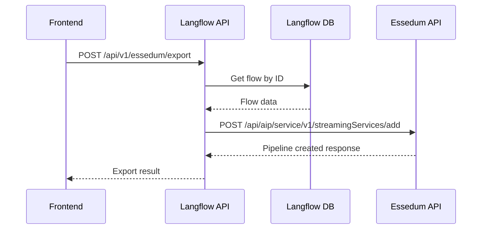

# Essedum Export Integration

This module provides integration between Langflow and Essedum platform for exporting flows.

## Overview

When the "Export to Essedum" button is clicked:

1. **Frontend** calls Langflow backend API (`/api/v1/essedum/export`)
2. **Langflow Backend** retrieves the flow data and calls Essedum Java API
3. **Essedum Java Backend** creates the pipeline and returns response
4. **Response** flows back through Langflow to frontend

## API Endpoints

### POST /api/v1/essedum/export
Exports a Langflow flow to Essedum platform.

**Request Body:**
```json
{
  "flow_id": "string",
  "alias": "string (optional)",
  "description": "string (optional)", 
  "type": "AIAgent",
  "interface_type": "pipeline-agent",
  "is_template": false,
  "groups": []
}
```

### EXPORT_LANG_ESSEDUM Button Endpoints

These endpoints are used by the new EXPORT_LANG_ESSEDUM button functionality:

#### POST /api/v1/essedum/create-pipeline
Creates a pipeline in Essedum via Langflow backend (similar to create_pipeline but routed through Langflow).

#### PUT /api/v1/essedum/update-pipeline  
Updates a pipeline in Essedum via Langflow backend (similar to update_pipeline but routed through Langflow).

#### POST /api/v1/essedum/create-native-file
Creates a native file in Essedum via Langflow backend (similar to create_native_file but routed through Langflow).

**All endpoints return:**
```json
{
  "success": true,
  "message": "Operation completed successfully",
  "essedum_response": { "cid": 123, "status": "created" }
}
```

### GET /api/v1/essedum/health
Health check endpoint for Essedum connectivity.

## Configuration

Create a `.env` file or set environment variables:

```bash
# Required
ESSEDUM_BASE_URL=http://your-essedum-server:8080

# Optional
ESSEDUM_AUTH_REQUIRED=true
ESSEDUM_TIMEOUT=30
ESSEDUM_JWT_TOKEN=your_token
ESSEDUM_PARENT_TOKEN=your_parent_token
```

## Frontend Usage

### Regular Export (Direct to Essedum)
```typescript
import { export_to_essedum } from './services/exportModelService';

const handleExportToEssedum = async (flowId: string) => {
  try {
    const result = await export_to_essedum({
      flowId: flowId,
      alias: 'My Flow',
      description: 'Exported from Langflow',
    });
    console.log('Export successful:', result);
  } catch (error) {
    console.error('Export failed:', error);
  }
};
```

### EXPORT_LANG_ESSEDUM Button Usage (Via Langflow Backend)
```typescript
import exportModelService from './services/exportModelService';

// Create Pipeline
const handleCreatePipeline = async () => {
  try {
    const result = await exportModelService.export_lang_essedum_create_pipeline({
      alias: 'My Pipeline',
      description: 'Created via Langflow',
      type: 'AIAgent',
      jsonContent: { /* your flow data */ },
    });
    console.log('Pipeline created:', result);
  } catch (error) {
    console.error('Create failed:', error);
  }
};

// Update Pipeline  
const handleUpdatePipeline = async () => {
  try {
    const result = await exportModelService.export_lang_essedum_update_pipeline({
      cid: 123,
      alias: 'Updated Pipeline',
      description: 'Updated via Langflow',
    });
    console.log('Pipeline updated:', result);
  } catch (error) {
    console.error('Update failed:', error);
  }
};

// Create Native File
const handleCreateNativeFile = async (formData: FormData) => {
  try {
    const result = await exportModelService.export_lang_essedum_create_native_file({
      pipelineName: 'MyPipeline',
      organization: 'MyOrg',
      fileName: 'script.py',
      fileType: 'python',
      scriptFormData: formData,
    });
    console.log('Native file created:', result);
  } catch (error) {
    console.error('Native file creation failed:', error);
  }
};
```

## Backend API Flow



## Error Handling

The API handles various error scenarios:
- Flow not found (404)
- Access denied (403) 
- Essedum API unavailable (502)
- Invalid request data (400)

## Testing

Test the health endpoint:
```bash
curl http://localhost:7860/api/v1/essedum/health
```

Test the export endpoint:
```bash
curl -X POST http://localhost:7860/api/v1/essedum/export \
  -H "Content-Type: application/json" \
  -H "Authorization: Bearer YOUR_TOKEN" \
  -d '{
    "flow_id": "your-flow-id",
    "alias": "Test Export"
  }'
```

## Implementation Notes

- The existing `create_pipeline` functionality is not modified
- New code is added alongside existing functionality
- Authentication headers are automatically handled
- Session information can be passed from request context
- Error responses maintain consistency with existing API patterns